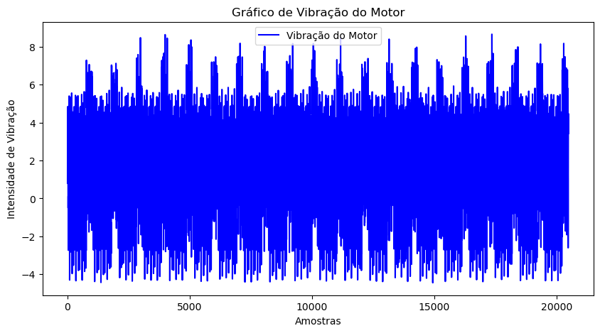
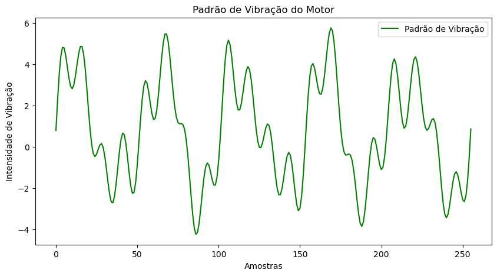
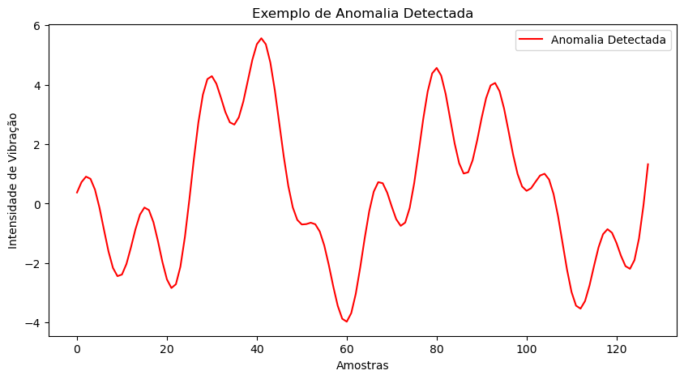

# Motor Vibration Analysis and Correlation Application

This project performs an analysis of motor vibration records, focusing on anomaly detection and determining the motor's condition and quality. The Python script reads acceptable vibration patterns and the dataset, calculates the correlation, splits the data into different batches, and classifies them into:
- Vibration OK
- Warning
- Anomaly

To determine its final state, identifying whether the motor is in poor condition and needs maintenance, or if it is in good condition.

## Datasets Used for Analysis
- [PADRAOVIBRACAOMOTORSTREAM009CC.txt](dataset/PADRAOVIBRACAOMOTORSTREAM009CC.txt)
- [VIBRACAOMOTORSTREAM009CC.txt](dataset/VIBRACAOMOTORSTREAM009CC.txt)

## Motor Condition Graph Plotting

